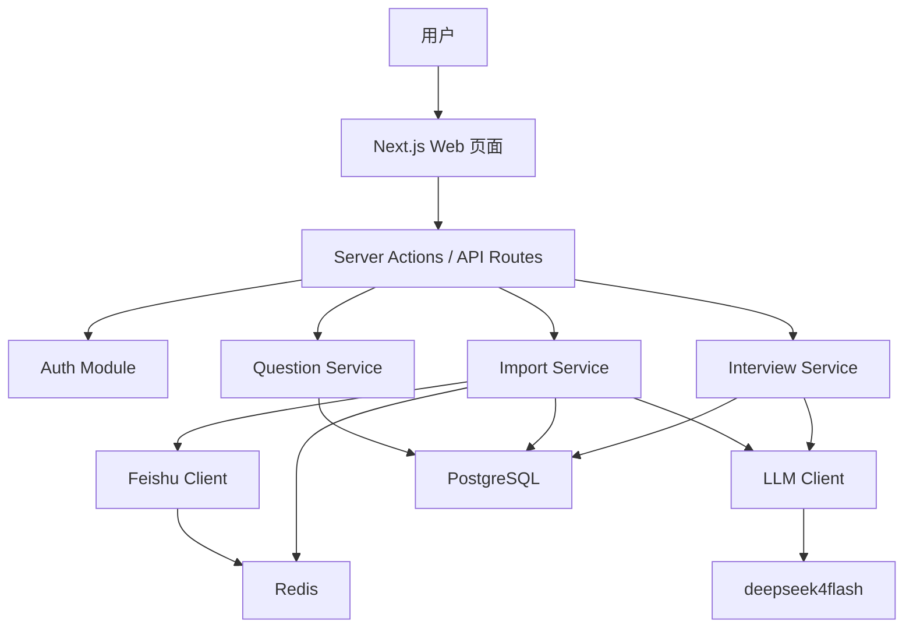
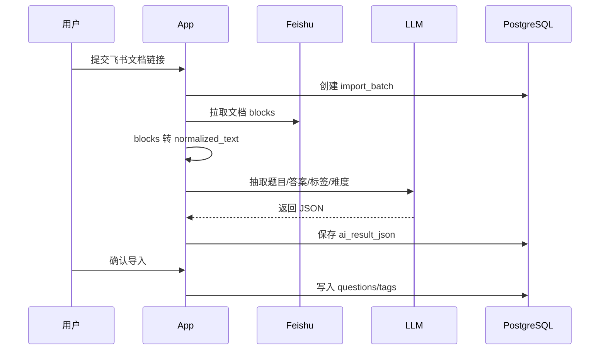

# AI 面试抽题网站技术架构

## 1. 架构目标

第一版目标是用最少工程复杂度快速做出可用 MVP。系统采用 Next.js 单体全栈架构，一个应用同时承载页面、API、服务端业务逻辑和数据库访问。

核心原则：

- 优先快速交付，不做微服务拆分。
- 所有外部能力通过清晰的 service 封装接入。
- 数据以 PostgreSQL 为准，Redis 只做缓存、状态和限流。
- AI 调用统一走一个 LLM Client，避免业务代码散落模型参数。
- 飞书导入结果必须经过人工确认后入正式题库。

## 2. 技术栈

| 模块 | 技术 |
|---|---|
| 应用框架 | Next.js App Router |
| 语言 | TypeScript |
| UI | Tailwind CSS + shadcn/ui |
| 表单校验 | React Hook Form + Zod |
| 数据库 | PostgreSQL |
| ORM | Prisma |
| 缓存/状态 | Redis |
| AI 调用 | OpenAI-compatible LLM Client |
| 鉴权 | 简单账号登录，优先 Auth.js 或自定义邮箱密码登录 |
| 部署 | 单应用部署 |

## 3. 总体架构



## 4. 代码目录建议

```text
app/
  (auth)/
  dashboard/
  banks/
  imports/
  practice/
  api/
components/
  ui/
  question/
  import/
  practice/
lib/
  auth/
  db/
  redis/
  env.ts
server/
  services/
    feishu/
    import/
    llm/
    question/
    practice/
  schemas/
  repositories/
prisma/
  schema.prisma
```

目录职责：

- `app/`：页面、布局、路由和轻量 API 入口。
- `components/`：可复用 UI 组件，业务组件按领域拆分。
- `lib/`：基础设施封装，例如 env、Prisma、Redis、Auth。
- `server/services/`：业务服务层，承载主要业务流程。
- `server/repositories/`：数据库读写封装，避免页面直接写复杂查询。
- `server/schemas/`：Zod schema、AI 输出 schema、表单 schema。
- `prisma/`：数据库 schema 和迁移。

## 5. 核心模块

### 5.1 Auth Module

第一版只需要满足内部使用。

职责：

- 登录、退出。
- 获取当前用户。
- 保护需要登录的页面和接口。

建议：

- 初期使用邮箱密码登录。
- 可以先不做注册，由管理员在数据库创建用户。
- 后续再接 GitHub、飞书 OAuth 或邀请码。

### 5.2 Feishu Client

职责：

- 使用 `FEISHU_APP_ID` 和 `FEISHU_APP_SECRET` 获取 `tenant_access_token`。
- 缓存 token 到 Redis。
- 解析飞书文档 URL，得到 `document_id`。
- 调用飞书文档 block API。
- 处理分页、限流、权限错误和文档不存在错误。

关键方法：

```ts
getTenantAccessToken(): Promise<string>
parseDocumentUrl(url: string): FeishuDocumentRef
listDocumentBlocks(documentId: string): Promise<FeishuBlock[]>
```

### 5.3 Import Service

职责：

- 创建导入批次。
- 拉取飞书文档 blocks。
- 将 blocks 归一化为 Markdown-like 文本。
- 调用 AI 抽取题目。
- 保存待确认的 AI 抽取结果。
- 用户确认后写入正式题库。

导入流程：



### 5.4 LLM Client

第一版主要模型：

- `deepseek4flash`
- 思考模式关闭

职责：

- 统一读取 `LLM_MODEL`、`LLM_API_KEY`、`LLM_BASE_URL`、`LLM_THINKING_ENABLED`。
- 统一设置关闭思考模式。
- 统一处理超时、重试、错误日志。
- 封装结构化输出调用。

建议方法：

```ts
extractQuestionsFromText(input: ExtractQuestionsInput): Promise<ExtractQuestionsResult>
selectPracticeQuestions(input: SelectQuestionsInput): Promise<SelectQuestionsResult>
gradeAnswer(input: GradeAnswerInput): Promise<GradeAnswerResult>
summarizePracticeSession(input: SummarizeSessionInput): Promise<SessionSummary>
```

### 5.5 Question Service

职责：

- 题库 CRUD。
- 题目 CRUD。
- 标签维护。
- 按标签、难度、来源、启用状态筛选题目。
- 给大模型抽题提供候选题。

### 5.6 Practice Service

职责：

- 创建练习会话。
- 调用大模型选择题目。
- 保存抽题理由。
- 保存用户回答。
- 调用 AI 评分。
- 生成会话总结。

抽题策略：

1. 先由系统根据题库、标签、难度、启用状态筛出候选题。
2. 将候选题摘要和用户历史表现传给大模型。
3. 大模型返回题目 ID 列表、选择理由和整体策略。
4. 系统校验题目 ID 是否存在且属于候选集。
5. 如果大模型失败或返回非法 ID，启用规则兜底。

## 6. 数据流

### 6.1 飞书导入数据流

```text
Feishu URL
-> document_id
-> Feishu blocks
-> normalized_text
-> LLM extraction JSON
-> import preview
-> confirmed questions
-> questions / tags / question_tags
```

### 6.2 大模型抽题数据流

```text
practice config
-> candidate questions from PostgreSQL
-> user practice history
-> LLM question selection
-> selected question IDs
-> practice_session
-> practice_session_questions
```

### 6.3 回答评分数据流

```text
user answer
-> question + reference answer + rubric
-> LLM grading
-> practice_answer
-> tag performance stats
-> session summary
```

## 7. 数据库设计

第一版核心表：

- `users`
- `question_banks`
- `feishu_sources`
- `import_batches`
- `import_items`
- `questions`
- `tags`
- `question_tags`
- `practice_sessions`
- `practice_session_questions`
- `practice_answers`

说明：

- `import_batches` 保存一次飞书导入任务。
- `import_items` 保存 AI 抽出的待确认题目，确认后再写入 `questions`。
- `questions.difficulty_score` 使用 0 到 100。
- `practice_session_questions` 保存本轮抽题顺序和大模型抽题理由。
- `practice_answers` 保存用户回答和 AI 评分结果。

## 8. Redis 使用

Redis 第一版用途：

- 缓存飞书 `tenant_access_token`。
- 保存导入任务的短期状态，例如 `pending`、`fetching`、`extracting`、`ready`、`failed`。
- 飞书 API 限流计数。
- LLM 调用限流计数。
- 可选缓存大模型抽题候选摘要。

不建议第一版使用 Redis 做：

- 持久业务数据。
- 复杂队列系统。
- 用户练习记录。

## 9. 环境变量

参考 `.env.example`。

必需变量：

```text
DATABASE_URL
REDIS_URL
LLM_MODEL
LLM_THINKING_ENABLED
LLM_API_KEY
LLM_BASE_URL
FEISHU_APP_ID
FEISHU_APP_SECRET
FEISHU_API_BASE_URL
```

安全要求：

- 不提交真实 `.env`。
- 不在日志中输出 API Key、数据库密码、Redis 密码。
- 服务端只通过环境变量读取密钥。

## 10. 错误处理

### 10.1 飞书错误

需要面向用户显示可理解的错误：

- 文档链接无效。
- 应用没有文档权限。
- 文档不存在。
- 飞书接口限流。
- 飞书 token 获取失败。

### 10.2 AI 错误

处理策略：

- JSON 解析失败时重试一次。
- 结构不合法时标记导入失败并保留原始输出。
- 抽题失败时使用规则兜底。
- 评分失败时允许用户重试。

### 10.3 数据库错误

处理策略：

- 所有写操作使用事务。
- 导入确认批量写入失败时整体回滚。
- 唯一性冲突给出明确提示。

## 11. 开发里程碑

### Milestone 1：项目骨架

- 初始化 Next.js、TypeScript、Tailwind、shadcn/ui。
- 配置 Prisma、PostgreSQL、Redis。
- 实现 env 校验。
- 实现基础布局和登录。

### Milestone 2：题库管理

- 完成 Prisma schema。
- 完成题库 CRUD。
- 完成题目 CRUD。
- 完成标签筛选和难度筛选。

### Milestone 3：飞书导入

- 实现 Feishu Client。
- 实现文档 block 拉取。
- 实现 block 转 normalized_text。
- 实现 AI 抽题。
- 实现导入确认页面。

### Milestone 4：智能抽题和练习

- 实现练习配置页。
- 实现大模型抽题。
- 实现练习会话。
- 实现回答评分。
- 实现会话总结。

## 12. 后续演进

- 将长耗时导入任务迁移到后台 worker。
- 增加飞书知识库空间批量同步。
- 增加多用户权限和题库共享。
- 增加语音面试。
- 增加岗位 JD 导入和定制练习计划。
- 增加题目去重、合并和版本管理。
